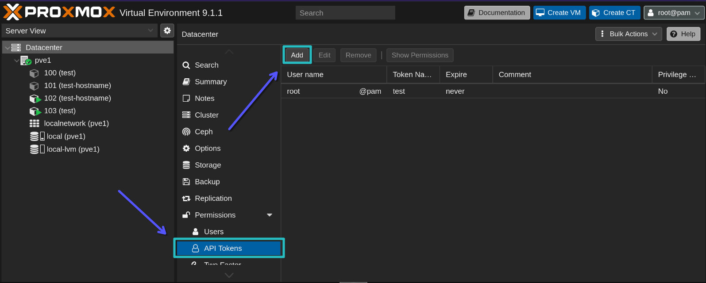

# Flask Proxmox LXC container request page

This is a basic website to allow other users to request the creation of LXC containers in a Proxmox environment. The user send the request and the administrators can refuse or accept them.

## How to run 🏃‍♂️‍➡️
This is a simple quick setup in local environment with Flask developing web server.
### Create the environment
Create the python environment:
    
    $ python -m venv .venv

Start the environment, example commando for linux bash systems:

    $ source .venv/bin/activate

### Install dependencies

    $ pip install -r requirements.txt

### Setup variables

The project read some environment variables, the SECRET_KEY and PROXMOX_API_TOKEN variables are not optional.
| Variable | Description |
| --- | ----------- |
| PVE_NODE | Proxmox node |
| ARCH | Processor architecture |
| CONTAINER_ROOT_STORAGE | The storage location of the container root |
| PVE_ADDRESS | *IP:PORT* of Proxmox server |
| **API_TOKEN*** | The secret Token of the Proxmox API. Format: USER@REALM!TOKENID=UUID |
| SQLALCHEMY_DATABASE_URI | The database used by the ORM |
| **SECRET_KEY*** | The secret key. |

***Save it in a safe place!!!**

#### How to add new proxmox key

### Start web server

First setup the db:

    $ flask db init
    $ flask db migrate -m "first migrate"
    $ flask db upgrade

Create your first admin user:

    $ flask create_user --username <username> --password <user password> --is-admin

Create your first normal user:

    $ flask create_user --username <username> --password <user password>

    If the user is admin it can manage the container requests.

And now you can start the web server:

    If you already set the env. variables:
    $ flask run

    Otherwise run with env. variables:
    $ SECRET_KEY='<your-key>' PROXMOX_API_TOKEN='<your-token>' flask run

### Configure templates
The template configuration is entirely to the web interface:
* Go to http://127.0.0.1:5000/admin/templates.
* **Map the templates**

In the "Map new template" form, the display name is the value used in the web interface, the Proxmox name is the full name of the template inside Proxmox.

Example:

    Display name: Alpine
    Proxmox name: local:vztmpl/alpine-3.22-default_20250617_amd64.tar.xz.